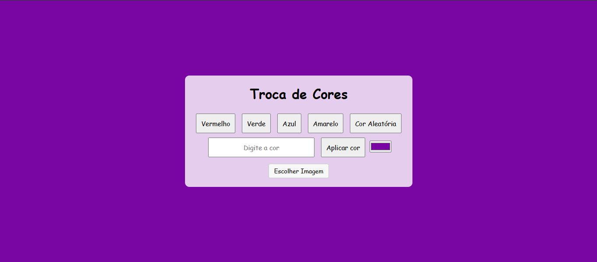

# Projeto Cor de Fundo

Um site que você muda a cor de fundo escolhendo as cores dos botões ou criando cores através da paleta de cores ou digitando o nome da cor em inglês. Você também pode colocar uma imagem de acordo com as fotos que você tem salva no seu computador ou no celular.

## Link do projeto

Esse é o link do meu projeto: <a href= "https://anajulialeite.github.io/Projeto_cor_de_Fundo/">Tela de Fundo</a>

## Demonstração

## License

